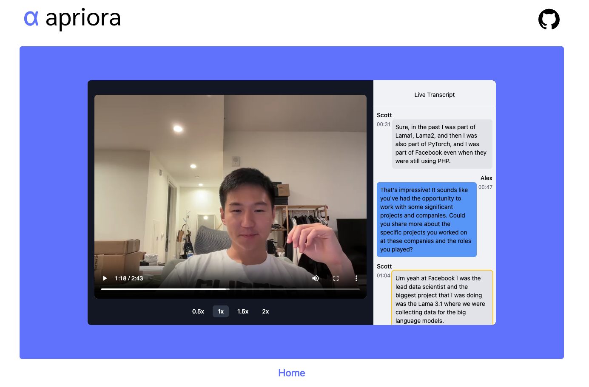

# 🎨 Scott's Apriora

Hiring the best candidates, faster 🏎️

### Tech Stack

- t3 stack: next.js, tailwind, typescript, with server actions instead of trpc
- drizzle ORM with Postgres db

### Other Notable Libraries

- react-webcam for video & audio streaming
- ai & @ai-sdk for object generation (json mode)
- openai for stt and tts

### Cloud Providers

- Vercel for server
- Neon for managed Postgres

### What's next

1. Record the entire video stream
   - record from start to end
   - augment with Alex's inputs
   - store in S3 bucket
2. Actually store the transcripts
   - currently not storing anything, even though the schema is ready (not actually using Neon 🤭)
   - should store each `Message` and inside it a `timestamp` as part of the video stream
3. Build a dashboard
   - Replay the video stream with the transcripts
   - Clicking on each bubble should rewind to that particular timestamp

### Features I loved building

- complete control using just voice - buttons are optional
- ability to interrupt Alex when she's talking
- the small square indicating when Alex is talking
- prettifying the whole thing 🎨

Overall, thanks for this super fun project. Would have built it even if it were not a test anyway. Let me know if you want me to implement some additional features. Hope to hear back soon 🚀
